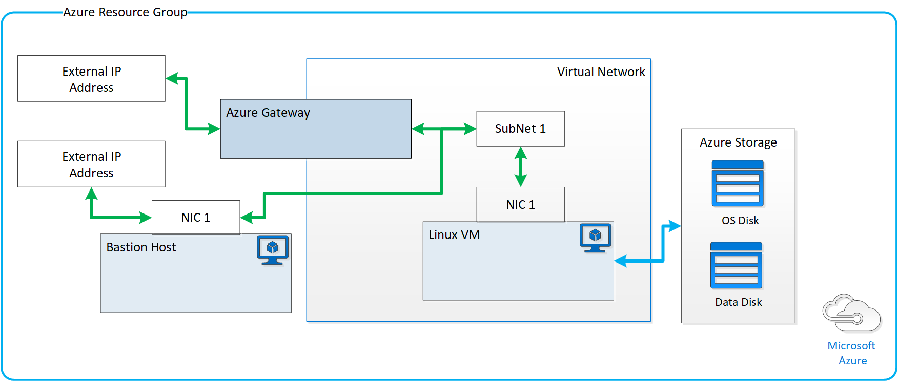

# Deployment of the Azure Gateway with a Linux VM and a Bastion Host

This template allows you to deploy an Azure Gateway, that routes traffic to a Linux VM running NGNIX. The Linux VM does not have a public IP address,since  it gets its IP from the private Subnet behind the Application Gateway. In order to access the private subnet, we have deployed a Bastion Host(Jumpbox). The following diagram shows the high level deployment architecture: 

This template takes a minimum amount of parameters and deploys a Linux VM, using the latest patched version.
it 
**Note:** The Azure Application Gateway may take up to 17 minutes to be completely deployed and configured.   

###Recommendations 
	
- Verify that VM names are unique in your terraform script
- Inline scripts (code executed in the the VM) may fail if the VM does not have a public IP assigned. 

### Setting up the SSH Certificates

In order to use this sample, we recommend creating SSH keys to secure both the Linux VM and the Bastion Host.  The SSH keys need to be located in the same machine where Terraform is executed.

SSH keys configuration lives on two files: variables.tf & main.tf. These variables file requires the path to the SSH Keys: 

| Variable      | Description    | Cool  |
| ------------- |:-------------:| -----:|
| public_key_path| The local path to the SSH public Key | $1600 |
| private_key_path| The local path to the SSH private Key       |   $12 |

## main.tf
The `main.tf` file contains the actual resources that will be deployed. It also contains the Azure Resource Group definition and any defined variables.

## outputs.tf
This data is outputted when `terraform apply` is called, and can be queried using the `terraform output` command.

## provider.tf
Azure requires that an application is added to Azure Active Directory to generate the `client_id`, `client_secret`, and `tenant_id` needed by Terraform (`subscription_id` can be recovered from your Azure account details). Please go [here](https://www.terraform.io/docs/providers/azurerm/) for full instructions on how to create this to populate your `provider.tf` file.

## terraform.tfvars
If a `terraform.tfvars` or any `.auto.tfvars` files are present in the current directory, Terraform automatically loads them to populate variables. We don't recommend saving usernames and password to version control, but you can create a local secret variables file and use the `-var-file` flag or the `.auto.tfvars` extension to load it.

## variables.tf
The `variables.tf` file contains all of the input parameters that the user can specify when deploying this Terraform template.

